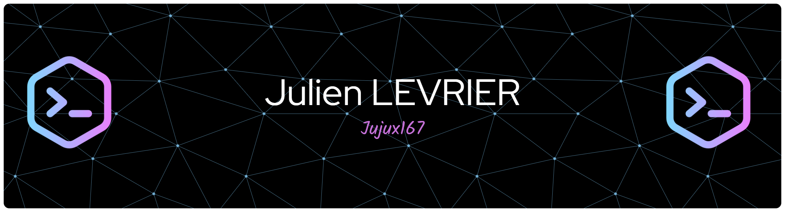

# Bienvenue sur mon profil GitHub !

👋 Salut, je suis actuellement en **ING3** à l'ECE Paris, passionné par la programmation, l'électronique et la mécanique.

## 🌐 Systèmes d'exploitation
- **TempleOS**
- **Amog-OS**
- **Nyarch**
- **Windows 11**

## 💻 Langages de programmation
- **HolyC**
- **Batch**
- **C**
- **Python**
- Et bien d'autres...

  
## 🖥️ Mon PC
Petit PC portable qui fait le taf

- **Modèle** : Acer Nitro V15 2024
- **Processeur** : Intel Core i7-13620H
- **Carte graphique** : NVIDIA GeForce RTX 4050H
- **RAM** : 24 Go DDR5
- **Stockage** : SSD 2 To NVMe + SSD 500 Go NVMe
- **Systeme** : Arch Linux

Gros PC portable pour charbonner

- **Modèle** : MSI Crosshair 16 HX AI
- **Processeur** : Intel Ultra 7 255HX
- **Carte graphique** : NVIDIA GeForce RTX 5070
- **RAM** : 64 Go DDR5
- **Stockage** : SSD 2 To NVMe + SSD 500 Go NVMe
- **Systeme** : Windows 11 famille

## 🔧 Périphériques et équipements
### 🖨️ **Imprimante 3D**
- **Modèle** : Creality Ender 3 Pro

### ⌨️ **Clavier mécanique custom**
Assemblé à partir d'un kit avec des switches personnalisés pour une expérience de frappe optimisée.

## 🚀 Mes projets
### 🎮 **Fruit Ninja en FPGA**
Un projet de jeu "Fruit Ninja" développé sur FPGA, utilisant une machine à états pour gérer la logique du jeu et les interactions en temps réel.

### ⏰ **Réveil en Arduino**
Un réveil personnalisé basé sur une plateforme Arduino, avec des fonctionnalités comme l'affichage de l'heure, l'activation de sons et la gestion des alarmes.

### ⌨️ **Clavier mécanique custom**
Assemblage d'un clavier mécanique en kit avec des switches personnalisés pour une expérience de frappe optimale.

### 🎮 **Mini jeu sur manette**
Développement d'un mini jeu sur une manette avec un ATtiny, un écran OLED, un accéléromètre et une PCB pour une expérience de jeu interactive.

### ⌨️ **Clavier OSU personnalisé**
Création d'un clavier osu en utilisant des pièces de 5 centimes et le principe capacitif, optimisé pour la rapidité et la précision.

### 🖥️ **Projets divers**
Des projets allant de la programmation de microcontrôleurs à la création de systèmes embarqués, ainsi que des travaux de **modélisation 3D** et des **systèmes électroniques**.

---

# 640x480 16 couleurs --> meilleure résolution

A wise man once said: "If you know Assembly, every software is open source."

"An idiot admires complexity, a genius admires simplicity." -Terry A. Davis

---

---

---

## 📫 Contact

  

